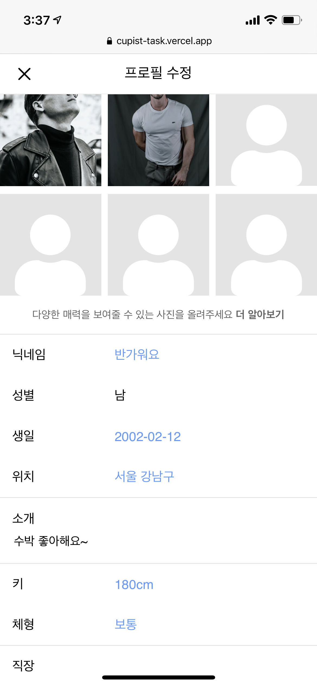

# 큐피스트 프론트엔드 과제

## 구현 기술

생산성과 유지보수에 장점이 있는 React를 사용하여 개발하였습니다.

## 사용된 모듈

### react-icons

react에서 여러 아이콘들을 사용할 수 있게 만든 라이브러리입니다.

### react-router-dom

spa인 react에서 네비게이션을 사용할 수 있도록 해주는 라이브러리입니다.

### styled-components

CSS in JS를 사용하는 라이브러리입니다.

### react-responsive-carousel

react에서 캐러샐 기능을 사용할 수 있게 해주는 라이브러리입니다.

## 스크린샷

